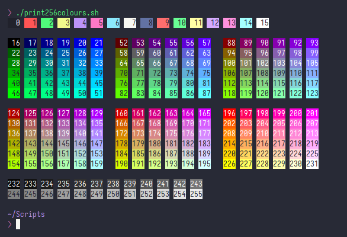

# Dracula for [tym](https://github.com/endaaman/tym)

> A dark theme for [tym](https://github.com/endaaman/tym).

## Install

put theme.lua inside your /home/<user>/.config/tym folder and you're done!

## License

[GPL License](LICENSE)

